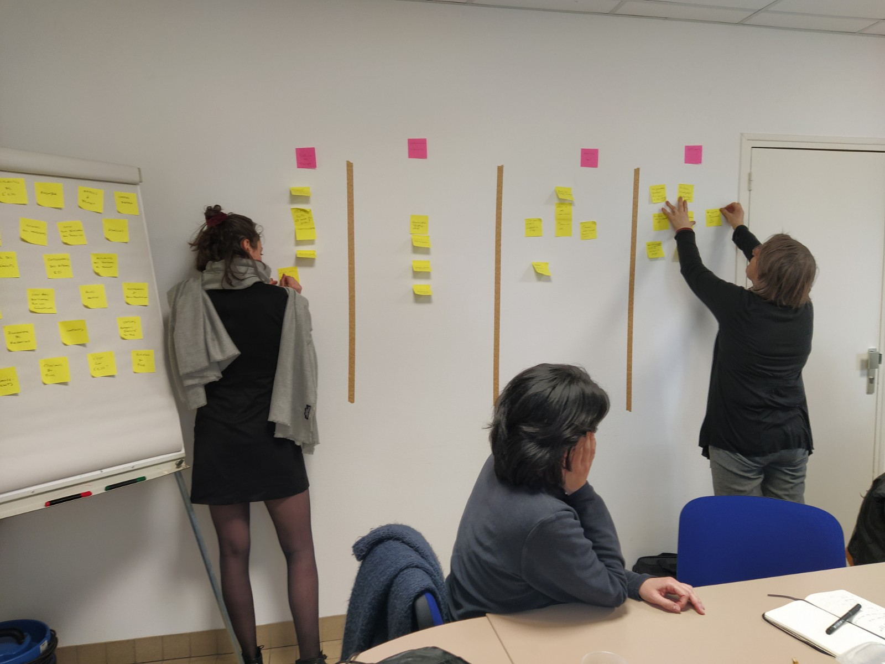

# Ateliers utilisateurices Pôle Brocéliande - Mardi 10 mars 2020

## Participant.e.s

### Atelier 14h - 15h30

- Porteuse de projet : primo accueil, porteuse de projet, galerie art contempo, Montfort
- Membre CA. Pour l'atelier, il endosse principalement la casquette de représentant d'une association
- Actuelle salariée : en remplacement congé mat', elle remet la casquette qu'elle avait il y a une poignée de mois, lorsqu'elle a étudié le site en vue de candidater sur le poste.
- Actuelle stagiaire com' : je lui demande d'endosser sa propre casquette, pour avoir un éclairage sur les difficultés ou bonheurs qu'elle rencontre avec le site dans sa pratique professionnelle.

### Atelier 18h30 - 20h

- Porteuse de projet : primo accueil, porteuse de projet, projet d'agriculture seule, pépinière fruitière et petits animaux, pays de brocéliande
- Membre CA : membre et et co-président du conseil d'administration du pôle ESS de Brocéliande

## Présentation / programme - 10min

- Qui suis-je et pourquoi je suis là ?
- Objectifs de l'atelier
- Déroulement

L'idée avec vous, c'est d'être sur du qualitatif, discussion, etc
Vous venez en tant que vous-même, vous êtes expert de votre profil, de vos besoins
Je ne vais pas arrêter de poser des questions, ce sera peut-être un peu énervant, c'est normal

## Tour de table - 10min

- qui es-tu, avec quelle(s) casquette(s) viens-tu ?
- quel est ton état d'esprit (météo) ? quelles attentes et/ou craintes ?

## Vous et le pôle - 10min

- c'est quoi le pôle ESS, pour toi ?
- 3 adjectifs qui devraient caractériser le site

### Porteuse de projet

Sert à fédérer des associations pour les former et mettre à disposition des annonces. Comme une maison des associations.
- identité singulière, pas institutionnelle, se démarque bien et donne envie (c'est ce qu'elle ressent avec l'identité actuelle et elle l'apprécie)
- pratique
- navigation simple

### Postulante

Plaque tournante positive d'un développement économique et social sur le territoire, à l'écoute de ce qui a envie d'émerger et est facilitateur de ce développement.
- beau et attractif
- donne envie d'aller voir
- m'apprends des nouveautés

### Représentant asso

Lieu de ressourcement, de synergie d'info sur ce qui est à caractère écologique, social et solidaire
- un site sur lequel on puisse échanger, répondre, trouver des ressources
- suivre la vie des actions qui se mènent
- sympa, facile d'accès (site actuel pas si mal ?)

### Stagiaire com'

Le pôle est là pour les asso et les porteurs de projets, on est sensé les soutenir
Médiateur de promotion et développement de l'ESS sur le territoire
- ergonomie
- visible (bien référencé), qu'on ait pas besoin de passer par une recherche sur "bras" ou "brocéliande" pour le trouver
- beau, en gardant le côté nature, environnement

### Membre CA - Dirigeant SCOP

Centre de ressource pour les projets ESS
- mis à jour régulièrement
- qu'il y ait de belles histoires, témoignages d'ESS du pays, authenticité (le + varié pour qu'on puisse toucher le + de monde)

### Porteuse projet

Lieu où peuvent se retrouver les acteurs de l'ESS du territoire, pour encourager les dynamiques, les partenariats
- riche
- site bien actualisé
- clair, on trouve facilement les infos
- rapide, léger, qui se charge bien

Ce qui a déplu sur site actuel :
- menu central bizarre, "je n'ai pas l'habitude"
- en lisant BRAS, je ne voyais pas le lien avec l'ESS, j'avais l'impression que c'était plus une maison des associations
- webradio : je m'attendais à de la musique

## Must have - 20min

Qu'est-ce qui selon vous est indispensable (rubrique, élément, fonctionnalité...) à trouver sur le site ?
Ordonnez par ordre d'importance pour vous.

### Porteuse de projet

1. **C'est quoi l'ESS** : car ça fait du bien de voir que ça existe ! et ça permet de vérifier si mon projet entre dans le cadre
2. **Liste des adhérents et mise en avant d'adhérents** (description + lien) : pour visualiser de qui il s'agit, repérer mes pairs, sentir que je fais partie d'une communauté
3. **Cartographie** : cf [carte art contemporain en Bretagne](https://www.artcontemporainbretagne.org/structures/)
4. **Agenda** (planning des formations - "c'est tout ce que je connais de ce que fait le pôle) - **contact** 

> Je me demande qui d'autre porte un projet, qui est allé jusqu'au bout

> Sur le site actuel, j'aime qu'il y ait une webradio : on voit rarement ça, ça donne un côté humain et vivant, ça permet de bien se démarquer

> Moi, ma première action, ça a été d'appeler la coordinatrice (plutôt que de fouiller le site dans le détail)

=> Faire du réseau, connaître les événements et avoir des contacts pour participer à ces événements

### Postulante

1. Une représentation dynamique, belle et attractive de **ce qu'est le pôle** (statuts, objectifs, actions)
2. Des liens vers **le réseau et les partenaires ESS** (entreprises, collectivités) : pour voir avec qui travaille le pôle
3. Un **agenda** des événements à venir
4. Un **lieu interactif d'échanges et d'infos**
5. Des **photos / témoignages** d'expériences ou projets
6. Des témoignages **écrits ou vidéo** de porteurs de projets : ici on n'est pas dans de l'informatif (comme l'agenda) mais sur ce qui fait sens
7. Des **retours des événements**

> J'aime bien quand il y a des photos qui bougent (comme sur site de Vallons, carousel), et le site actuel du BRAS, c'est vide, ça manque d'ameublement. Le sensoriel apporte de la chaleur
> J'ai + compris l'ESS en suivant les liens qui amenaient chez les partenaires qu'en lisant le site du pôle

Au sujet des échanges, interactions : exemple d'échanges mails intéressants autour des projets de ressourcerie / recyclerie. Aimerait une extension sur le site de ces échanges pour les rendre visibles.

### Représentant asso

1. **Communication / information sur les activités de mon asso**
2. **Vivier de compétences** (ex: pour tel événement j'ai besoin d'un chanteur)
3. **Synergie interasso ou structures** : c'est la finalité des échanges, en fait. Faire se croiser des structures / individus qui auraient aucune chance de se croiser autrement (ex : asso nature qui cherche un expert de la forêt pour une balade, peut-être qu'un chasseur est la personne qu'il leur faut ?)
4. **Ressources en matériel**

=> Focale sur les échanges, discussions, annonces, mutualisation entre structures

### Stagiaire com'

1. **Agenda des formations / événements du pôle** : c'est peut-être ce qui illustre et fait comprendre le mieux ce que fait le pôle, montre aussi à qui il s'adresse (auj: l'agenda est même pas sur la page d'accueil). Evénements : ce que le pôle fait, mois ESS, participation à des journées...
2. **Actions du pôle** (photos, articles) : quel porteur de projet on accompagne, quel projet on mène
3. **Missions du pôle**
4.**C'est quoi l'ESS ?** + **actualités de l'ESS en Bretagne** : périmètre Bretagne pour montrer la vitalité de la région, et que si quelqu'un veut se lancer ailleurs, c'est possible, il y a aussi de l'activité ailleurs
5. Liens vers **ressources/ documentation** d'autres acteurs de l'ESS
6. **Contacts** : tel, mail, adresse, **adhésion en ligne**, **inscription aux formations en ligne**...
7. **Membres, salariés du pôle, présentation de l'équipe** : intéressant pour savoir à qui je m'adresse + côté humain

### Membre CA - dirigeant SCOP

- Nouveautés, création de projets ou de structures, actus
- Des projets inspirants pour donner envie de faire de l'ESS
- infos sur les prix, les appels à projets

### Porteuse de projet

- Réseau ESS du territoire (pour pouvoir m'y impliquer)
- Actualités du réseau et de l'ESS en France
- Définition du pôle
- Définition de l'ESS
- AaP, concours, appels à témoignage
- Agenda
- Equipe, pour savoir à qui je peux parler

### Dans le détail

Pouvez-vous expliquer votre colonne des priorités ? Qu'est-ce que vous mettez sous chaque étiquette ? Pourquoi c'est important pour vous ?

Notes en vrac, appartés et digressions des participants :

Entrée par problématique ?
- je veux me former
- je veux trouver des partenaires
- je veux trouver des sous

Membre du CA :
> Je pense qu'il faut qu'on garde un passage obligé par le pôle. On est attaqué par des élus, si on redirige trop ailleurs, on fait quoi ? On a besoin d'être sollicités, d'être acteur

Des documents aujourd'hui internes pourraient intéresser des partenaires (ex : travail sur le GPECT)

### Ce que j'en retiens

#### En vrac

- le site doit bien acter qu'il s'agit d'un pôle ESS et pas d'un maison des asso
- interrogation sur la nécessité de refaire le site (finalement les personnes interrogées en sont pas mécontentes ?)

#### Enjeux à creuser en atelier stratégique

Des moyens de donner du temps / ou au moins de ne pas en prendre, sur l'alimentation du site.
- publication automatique sur les réseaux sociaux
- faire contribuer le CA à la veille et diffusion d'infos
- mise en place de listes de discussion

Pour le contenu : faire le tri entre ce qui existe déjà (qu'on peut repomper), ce qui est à mettre à jour, et ce qui n'existe pas encore. Faut-il donner de l'énergie à ce qui n'existe pas encore, ou simplement valoriser ce qui est déjà là ?

Lever la crainte de trop donner d'infos en ligne et que leurs interlocuteurs ne soient plus obligés de passer par eux ?