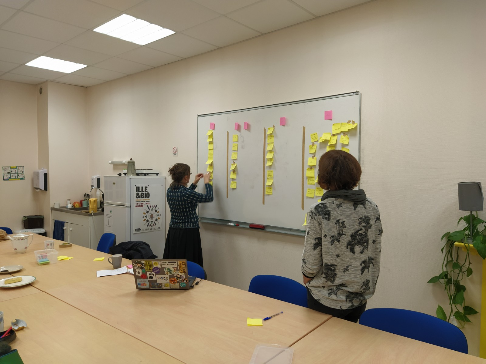
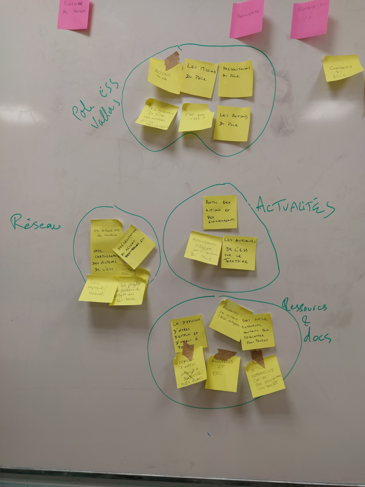

# Ateliers utilisateurices Pôle Vallons Solidaires - Lundi 9 mars 2020

## Participant.e.s

### Atelier 14h - 15h30

5 personnes présentes :
- une adhérente, porteuse de projet (maison de l'alimentation, incubée au TAG)
- 3 membres du CA, profil entrepreneure
- une membre du Conseil de Développement

### Atelier 18h30 - 20h

3 personnes présentes :
- membre de Bretagne Porte de Loire Communauté, en charge d'une recherche-action orientée jeunes + membre du CA
- une personne travaillant pour TZA + membre du CA
- la salariée du Pôle

## Présentation / programme - 10min

- Qui suis-je et pourquoi je suis là ?
- Objectifs de l'atelier
- Déroulement

L'idée avec vous, c'est d'être sur du qualitatif, discussion, etc
Vous venez en tant que vous-même, vous êtes expert de votre profil, de vos besoins
Je ne vais pas arrêter de poser des questions, ce sera peut-être un peu énervant, c'est normal

## Tour de table - 10min

- qui es-tu, avec quelle(s) casquette(s) viens-tu ?
- quel est ton état d'esprit (météo) ? quelles attentes et/ou craintes ?

Quelques attentes et envies en vrac :
- curiosité sur la méthodologie
- j'aimerais que ce soit un beau site, car la communication de Vallons, ça fait un moment qu'on en parle
- Enjeu de montrer une démarche claire : dans le CA on fait beaucoup de réseau, on parle beaucoup du Pôle
- Envie de donner envie aux gens de revenir sur le site

## Vous et le pôle - 10min

- c'est quoi le pôle ESS, pour toi ?
- 3 adjectifs qui devraient caractériser le site

### Partenaire

Un réseau d'acteurs qui a pour objet de promouvoir la culture ESS sur le territoire et accompagne les porteurs de projets
- intuitif
- gai
- organisé

#### Membre CA

Même définition que la précédente + notion de ressources et de catalyseur
- ouvert
- réfléchissant : sert de miroir à l'intensité de l'ESS sur le territoire. Auj : ne reflète pas la dynamique de l'ESS
- accessible (facile de naviguer)

### Membre CA

Idem + accompagnement de projet collectif, un espace qui rassemble et sème des graines pour les autres, logique d'essaimage
- vivant
- inituitif, facile à prendre en main

### Porteuse projet

Acteur de mise en réseau, qui fait la promotion des acteurs de l'ESS
- complémentaire à facebook (car aujourd'hui, facebook me suffit, on y retrouve toute l'actu). Donner une fonction de ressource au site ?
- pratique
- pas trop surchargé

### Membre CA

Soutien aux porteurs de projets collectifs et aux associations, mise en réseau, lieu ressource sur l'ESS. Que le site puisse retranscrire l'actu du pôle et du territoire. Qu'il apporte de la visibilité aux acteurs, à l'ESS, au territoire.
- intuitif
- pratique
- joyeux

### Partenaire

Une association animatrice des questions ESS sur le territoire
- coopératif
- dynamique
- local

### Membre CA

Fédérateur de l'ESS sur le territoire
- informatif
- clair
- participatif

### Porteuse de projet arrivant sur le territoire

Structure d'accompagnement pour porteurs de projets en ESS et développement durable
- ressourçant
- dynamisant
- innovant

## Must have - 20min

Qu'est-ce qui selon vous est indispensable (rubrique, élément, fonctionnalité...) à trouver sur le site ?
Ordonnez par ordre d'importance pour vous.

### Membre CA

1. Espace admin
2. Un agenda
3. Les actus
4. Offres d'emploi, appels à bénévoles, bons plans
5. Les actions / projets coup de coeur
6. Infos, outils, ressources pour les porteurs de projet et les politiques
7. Cartographie des acteurs du territoire
8. Les missions du pôle et les actions qui en découlent
9. Adhésion
10. Contact

### Membre CA

1. Présentation du pôle
2. Lien administrateur
3. Un agenda
4. Les actualités du pôle
5. Photos des actions et événements
6. Les adhérents
7. Les projets et porteurs de projet du territoire
8. Outils, ressources, contacts pour développer mon projet
9. Ressources et doc
10. Financement

### Membre CA - utilisatrice

1. Actions du pôle
2. Agenda
3. Actualités du pôle et de l'ESS
4. Contacts
5. Carte des acteurs
6. Infos adhésion
7. Ressources
8. Offres d'emploi, AAP, besoins matériel du territoire
9. Veille sur projet en création / réflexion

### Porteuse de projet

1. Agenda (actions du pôle et des partenaires)
2. Ressources pour les acteurs (suivant typologie : asso, entrepreneurs...)
3. Les actualités du Pôle
4. Les acteurs ESS du territoire
5. Infos sur l'adhésion et ses avantages
6. Les missions du Pôle
7. C'est quoi l'ESS

### Partenaire

1. Actu ESS du territoire
2. Agenda
3. Actions en cours (pour se mettre en synergie)
4. Appels à projets (pour pouvoir les relayer)
5. Missions du Pôle

### Membre du CA

1. C'est quoi l'ESS ?
2. Les missions du pôle
3. les missions du pôle et les actions qui en découlent
4. Agenda pôle et partenaires
5. Contacts
6. Ressources pour les acteurs (asso, entrepreneur)
7. Accès admin
8. Photos des actions et événements

### Partenaire

1. Présentation du pôle
2. Les actions du pôle
3. Les actualités de l'ESS sur le territoire
4. Outils, ressources, contacts pour développer mon projet
5. Agenda
6. Diffusion d'offres d'emploi et d'appels à projet

### Porteuse de projet

1. Les projets et porteurs de projet du territoire
2. Lieux inspirants / innovants
3. Présentation du réseau ESS
4. Les acteurs ESS du territoire
5. Cartographie des acteurs de l'ESS
6. Contacts adhérents
7. Actions du pôle
8. Outils, ressources, contacts pour développer mon projet
9. Ressources et docs
10. Offres d'emploi

### Dans le détail

**Actualités**
- description de projets en cours du pôle et des acteurs. Différencier actus du pôle / actus d'autres acteurs. Pourquoi ?
  - si je veux des infos, je vois directement à qui je dois m'adresser)
  - enjeu de visibilité
  - pour que les gens se rendent compte de ce que le pôle peut leur apporter et de ce qui existe sur le territoire
  - pour montrer que le pôle est actif, qu'il mène des actions en propre
  - incarne la valeur du pôle, au service de la dynamique du territoire

Attention : quel périmètre donner aux actus ? Uniquement pôle + partenaires ? Ou bien mutualiser un outil d'agenda ?

**Agenda** 
- même logique de distinction, même limites
- agenda local ? Agenda que ESS ? Mais selon quels critères : statuts ? se réfère à l'ESS ?

**Bons plans** : offres d'emploi, asso qui recherchent, bons plans du réseau...

**Ressources** : 
- guides suivant type de structure, même si c'est des liens, + financements
- exemple : fiche sur comment se passe un accompagnement
- les compte-rendu des CA (ressource interne, avec accès admin)
- en tant que partenaire, ça m'intéresse pour pouvoir renvoyer des jeunes vers le site s'ils ont besoin de ressources
- besoin de fiches ressources sur comment mener un projet, par exemple
- contacts des acteurs de l'accompagnement sur le territoire

**Adhésion** : un des domaines où ça grippe un peu. Montrer en quoi le pôle est utile ? Par exemple réserver la visibilité (actu, carto) aux adhérents ?

**Définition de l'ESS** : plate, correspond même pas à ce que Céline défend

**Style** : couleurs actuelles ternes, pas joyeuses

**Missions du pôle** : ça intéresse des gens qui se demandent si le pôle peut leur être utile

**Accès admin** : un outil permettant de centraliser les docs. Enfin, il faudrait quand même des notifications mails. Finalement, là ça fonctionne déjà pas trop mal, c'est peut-être pas prioritaire.

**Contacts** : des administrateurs, des adhérents, des partenaires... tous ceux qui gravitent autour du pôle, dans une logique de répertoire.
- pour que "ça pèse", montrer le carnet d'adresse, que le pôle est central et a un réseau énorme

**Photos des actions** : pour parler à ceux qui sont + visuels que texte

**Action en cours**
- en tant que partenaire, ça m'aide à réfléchir aux projets que je mène. Par exemple, si j'ai à proposer des formations, je vais voir le programme de formation pour voir si qqch correspond, idem pour proposer des temps forts.

**Diffusion appels à projets** 
- la salariée fait déjà un boulot très intéressant là-dessus, ça m'intéresse pour relayer localement

**Réseau ESS**
- le pôle et ses adhérents

- complémentaire à facebook (car aujourd'hui, facebook me suffit, on y retrouve toute l'actu). Donner une fonction de ressource au site ?

### Organisation des informations

Avec le groupe du soir, plus réduit, on a même pu aller jusqu'à un début d'organisation de l'info.

Consigne : Tous ces éléments, j'aimerais que vous les regroupiez et organisiez de façon cohérente, comme si vous organisiez le menu du futur site.

- Pôle ESS Vallons
  - Actions du pôle
  - Missions du pôle
  - Présentation du pôle
  - C'est quoi l'ESS ?

- Réseau - l'ESS sur le territoire
  - les acteurs ESS du territoire
  - Présentation du réseau ESS
  - Une cartographie des acteurs de l'ESS
  - Lieux inspirants / innovants
  - Contacts adhérents
  - les projets et porteurs de projet du territoire

- Actualités
  - Evénements du pôle
  - Les actualités de l'ESS sur le territoire
  - Photos des actions et des événements

- Ressources et docs
  - diffusion d'offres d'emploi et d'appels à projet
  - ressources pour les acteurs (asso, entreprises...)
  - outils, ressources, contact pour développer mon projet

- Contacts du pôle

- Admin
  - accès admin adhérents / CA
  - agenda interne

### Ce que j'en retiens

#### En vrac

- envies d'implication du CA, par exemple sur la diffusion d'info. Des modalités de contribution à penser ? 
- aujourd'hui les utilisateurs ne vont pas sur le site car les actus sont sur facebook et diffusées par mails + que sur le site ?
- envies d'un site + joyeux
- grosses valorisations des contenus chauds, ceux qui sont aussi les plus chronophages à produire
- ton du site à revoir (moins formel, moins scolaire ?)

#### Enjeux à creuser en atelier stratégique

1. choix du type de structuration de contenus

Par catégorisation basique ?
- présentation (ESS, le pôle, ses missions et actions)
- réseaux (adhérents, partenaires, carto...)
- ressources (documentation, fiches pratiques...)

Par profil / action ?
- je veux être accompagné
- je veux dynamiser le territoire

2. Contenus chauds : comment les produire, comment les gérer ?